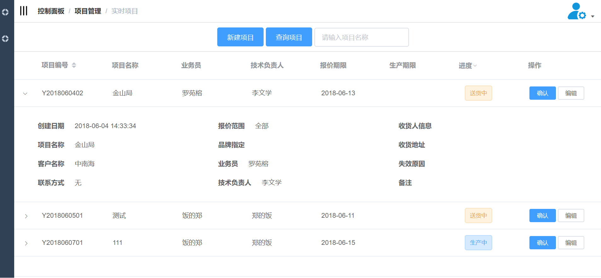
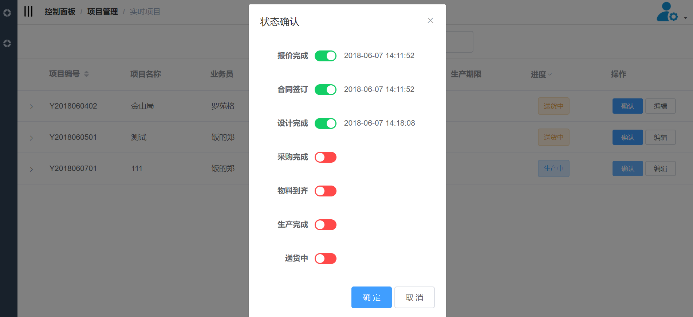
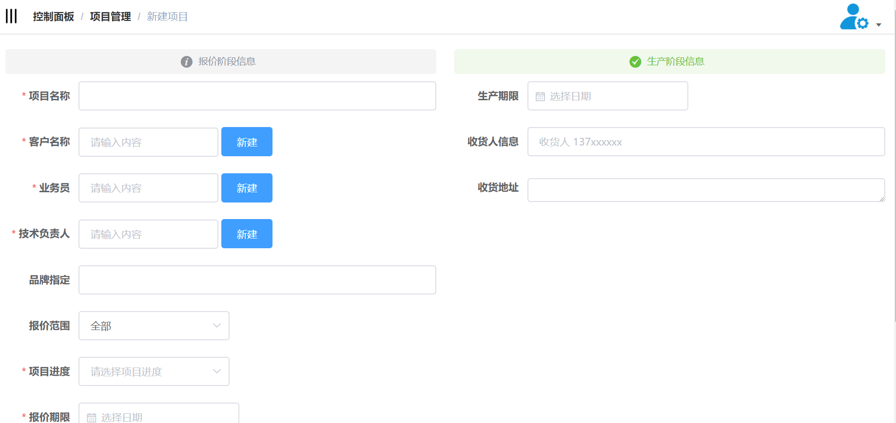

# 总结
> 该项目是为了方便公司进行项目管理而建立的后台系统 
[预览](http://yinengdk.com/admin)
[项目引用模板](https://github.com/PanJiaChen/vueAdmin-template/blob/master/README-zh.md)
### 功能展示

### 解决的问题
减少每个部门人员之间的沟通成本，让每个项目的进度可追踪，员工可以合理安排自己的工作。

### 新认识的组件
- moment 时间组件。
- koa 使用async做异步操作，非常方便，相对express更轻量化，需要自己搭配其余组件，例如：koa-router。
- vuex 状态管理。

### 无法解决的问题
- 表单打印，无法解决web浏览器打印问题，达不到excel的打印功能。
- 连接公司的nas服务器，进行一些文件操作。
- 与其他软件对接。

### 感想
由于个人技术问题，很多问题无法解决，无法跟报价软件，仓库的软件对接，功能太少，感觉实用性不是很高，所以项目被搁置了。目前引入了一台nas服务器进行资料分类共享，也解决了部分问题，提高了效率。现认识到仅仅通过自学是比较难有发展的，需要一个适合的环境和平台。
